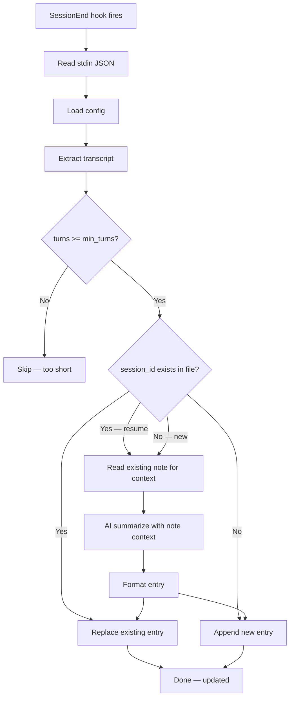

# claude-session-digest

> Auto-summarize Claude Code sessions into daily markdown digests.

Automatically captures what you worked on, summarizes it with AI (Haiku), and writes structured daily notes — either as plain markdown files or into your Obsidian vault.

## ⚠️ API Usage Warning

**This plugin makes an API call after EVERY Claude Code session.**

When a session ends, the script calls `claude -p --model haiku` to generate a summary. This means:

- **Each session = 1 additional API request** to Haiku
- On Pro/Max subscription, Haiku has a separate quota — usually free
- On API billing these are **real costs** per call
- Dozens of sessions per day = dozens of extra requests

**To disable AI summarization** (offline mode, no API calls):

```yaml
model: null
```

This uses the first user message as the session description instead. Works completely offline.

---

## How It Works



---

## Quick Start

### 1. Install the plugin

```bash
claude plugin install djimontyp/djdev-workshop/claude-session-digest
```

### 2. Create your config

```bash
cp "$(claude plugin path claude-session-digest)/config.example.md" ~/.claude/session-digest.local.md
```

Edit `~/.claude/session-digest.local.md` and set your `output_dir`:

```yaml
---
output_dir: ~/Documents/daily-summaries
model: haiku
min_turns: 3
---
```

### 3. That's it

Next time you end a Claude Code session, a summary entry appears in your daily file.

---

## Configuration

Config uses the `.claude/session-digest.local.md` format — YAML frontmatter in a markdown file.

> **Parser limitations:** The config parser supports only flat `key: value` pairs. YAML lists, nested keys, and multi-line strings are silently ignored. Stick to simple scalar values.

**Config cascade (first found wins):**

| Priority | Path | Scope |
|----------|------|-------|
| 1 | `SESSION_DIGEST_CONFIG` env var | explicit override |
| 2 | `{project}/.claude/session-digest.local.md` | per-project |
| 3 | `~/.claude/session-digest.local.md` | all projects |

**Recommended setup:** create `~/.claude/session-digest.local.md` once — it applies to all your projects automatically. Add a project-level file only when you need to override something for a specific repo.

**This file is never overwritten by plugin updates.**

### Core Options

| Key | Default | Description |
|-----|---------|-------------|
| `output_dir` | `~/daily-summaries` | Directory for daily `.md` files |
| `language` | `null` | Summary language (e.g. `uk`, `French`, `Українська`). `null` = no instruction, LLM defaults to English |
| `model` | `"haiku"` | AI model for summaries. `null` = offline mode (no API calls). See model options below |
| `min_turns` | `3` | Skip sessions shorter than N user messages |

### Model Options

`"haiku"` · `"sonnet"` · `"opus"` · `null` (offline — no API calls)

### Obsidian Integration

| Key | Default | Description |
|-----|---------|-------------|
| `obsidian_enabled` | `false` | Write to Obsidian vault instead of plain files |
| `obsidian_vault_path` | `""` | Absolute path to your vault root |
| `obsidian_daily_notes_dir` | `"Daily notes"` | Folder within vault for daily notes |
| `obsidian_date_format` | `"%Y-%m-%d"` | Date format for note filename |
| `obsidian_folder_format` | `"%Y/%m"` | Subfolder structure within daily notes dir |
| `obsidian_section_heading` | `"## Notes"` | Heading under which to insert session entries |
| `obsidian_wikilinks` | `true` | Use `[[project]]` wikilinks in project headings |
| `obsidian_template_path` | `""` | Path to template file for new daily notes. Supports `{{date}}` placeholder |

When `obsidian_enabled: true`, sessions are written into your Obsidian vault daily notes instead of plain files. The plugin inserts entries under `obsidian_section_heading`, grouped by project.

### Format Options

| Key | Default | Description |
|-----|---------|-------------|
| `group_by_project` | `true` | Group entries under project headings |
| `show_tools` | `true` | Show tools used in session |
| `show_files` | `false` | Show modified files list |
| `show_branch` | `true` | Show git branch |
| `project_heading` | `"### 🤖 {project}"` | Template for project heading. `{project}` = dir name |
| `entry_format` | `"**{time}** · \`{category}\` · {duration}"` | Template for entry header. Vars: `{time}`, `{category}`, `{duration}`, `{tools}` (tool count), `{branch}` |

---

## Output Format

### Plain Mode

```markdown
# Session Digest — 2026-02-21

### 🤖 my-project

<!-- session:abc123 -->
**09:15** · `feature` · 45m
> Implemented Telegram message parsing. Added extraction pipeline.

<!-- session:xyz789 -->
**20:00** · `refactor` · 1h 10m
> Refactored LoginPresenter. Updated CSS tokens.
```

### Obsidian Mode (with wikilinks)

```markdown
### 🤖 [[my-project]]

<!-- session:abc123 -->
**09:15** · `feature` · 45m
> Implemented Telegram message parsing.
```

---

## Commands

### `/digest-config`

Shows your current configuration and resolved config path:

```
claude-session-digest configuration
─────────────────────────────────────
Config file: ~/.claude/session-digest.local.md

Core settings:
  output_dir:  ~/Documents/daily-summaries
  model:       haiku
  language:    null
  min_turns:   3

Obsidian:
  enabled:     false  (plain mode — writing to output_dir)

Format:
  group_by_project: true
  show_tools:       true
  show_files:       false
  show_branch:      true
  project_heading:  "### 🤖 {project}"
  entry_format:     "**{time}** · `{category}` · {duration}"
```

---

## Daily Assistant Agent

This plugin includes a `daily-assistant` agent that knows about your Claude sessions and daily notes:

- **Morning** — shows yesterday's sessions, reminds of unfinished work
- **Evening** — includes sessions in day review
- **Analysis** — aggregates sessions by project, shows statistics
- **Notes** — quick notes with context from your vault

The agent reads from `~/.claude/session-digest.local.md` — no hardcoded paths.

---

## Troubleshooting

**No entries appearing?**

1. Check config exists: `cat ~/.claude/session-digest.local.md`
2. Check output dir exists: `ls ~/daily-summaries` (or your configured path)
3. Was the session long enough? Check `min_turns` setting
4. Run manually to test:

```bash
TRANSCRIPT=$(ls ~/.claude/projects/*/*.jsonl 2>/dev/null | tail -1)
echo "{\"session_id\":\"test\",\"transcript_path\":\"$TRANSCRIPT\",\"cwd\":\"$(pwd)\",\"reason\":\"user_exit\",\"hook_event_name\":\"SessionEnd\"}" | \
  python3 "$(claude plugin path claude-session-digest)/scripts/session-digest.py"
```

**AI summaries not working?**

Set `model: null` to use offline mode (first user message as description).

**Migrating from old config?**

If you had `~/.config/session-digest/config.json`, copy your settings to the new format:

```bash
cp "$(claude plugin path claude-session-digest)/config.example.md" ~/.claude/session-digest.local.md
# Then edit ~/.claude/session-digest.local.md with your previous settings
```

---

## Platform Notes

**Windows:** `~` in paths means `%USERPROFILE%` (e.g. `C:\Users\you`). In PowerShell, `~` expands automatically. In cmd.exe, use `%USERPROFILE%\.claude\session-digest.local.md` instead.

---

## License

Apache 2.0 — free to use and fork, attribution required.
